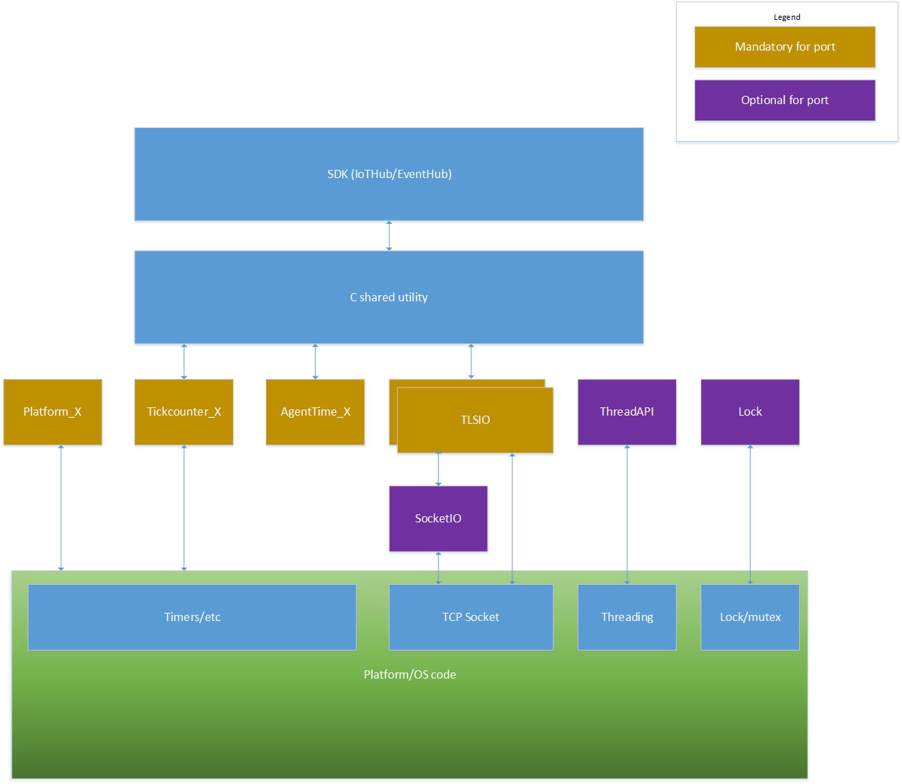

# How to Port the C Shared Utility to Other Platforms

The purpose of this document is to provide guidance on how to port the C Shared utility library to platforms not supported out of the box.
The C shared utility library is used by C SDKs like IoTHub client SDK and EventHub client SDK.  
The document does not cover the specifics of any particular platform.

# Table of contents

- [Overview](#Overview)
- [tickcounter adapter (mandatory)](#tickcounter-adapter)
- [agenttime adapter (mandatory)](#agenttime-adapter)
- [xio adapter (mandatory)](#xio-adapter)
- [platform file (mandatory)](#platform-file)
- [ThreadApi adapter](#threadapi-adapter)
- [Lock adapter](#lock-adapter)

<a name="Overview"/>
## Overview
</a>

The C shared utility library is written in C for the purpose of portability to most platforms.
However, several components rely on platform-specific resources in order to achieve the functionality required.
Thus, porting the C shared utility library is done by porting the PAL components (adapters) that are part of the library.
Below is a rough overview of the components:



There are several mandatory components for which an adapter must be provided:

- A `tickcounter` implementation: this provides the SDK an adapter for getting a tick counter expressed in ms. The precision does not have to be milliseconds, but rather the value provided to the SDK has to be expressed in milliseconds.

- An `agenttime` implementation: this provides the SDK adapters for the C time management functions like `time`, `difftime`, etc. This is needed due to the very wide spread differences in the way time is handled by different platforms.

- An `xio` implementation providing a TLS level adapter that can be used by the SDK. Alternately if any libraries supported out of the box by the SDK can run on the target then only a socket level `xio` adapter would be needed.

Additionally, there are two optional components (thread and lock) that are only required if it is desired that the SDK API should be thread safe and if the SDK should use a dedicated thread to schedule work done by the library.    

<a name="tickcounter-adapter"/>
### tickcounter adapter (mandatory)
</a>

If any of the existing adapters works for your platform simply include the desired adapter in your build.
If none of the existing tickcounter adapters work for your platform, you will have fill one in. Follow the below steps in this case:

i) Copy the tickcounter_template.c file from [here](https://www.github.com/Azure/azure-c-shared-utility/blob/adapters/template/tickcounter_template.c) and fill in the code:

ii) In case your platform/OS has a function that can provide a global timer/tick counter value then call that function in the `tickcounter_get_current_ms` function and perform any necessary conversions to convert the value to milliseconds.

iii) In case that your platform requires specific initialization/deinitialization for each tick counter instance that is created (like starting a timer or storing intermediate values), add the corresponding code in the `tickcounter_create` and `tickcounter_destroy` functions.

<a name="agenttime-adapter"/>
### agenttime adapter
</a>

Agenttime provides adapters for time functions.

For most platforms/OSs, the functions in agenttime can simply call the C functions `time`, `difftime`, `ctime`, etc.

If the platform/OS does not support some of these functions, then a replacement needs to be provided based on the specific real time clock implementation available on the platform/OS.

The template `agenttime` adapter can be found [here](https://www.github.com/Azure/azure-c-shared-utility/blob/adapters/template/agenttime_template.c).   

<a name="xio-adapter"/>
### xio adapter
</a>

`xio` is a simple bytes in/bytes out API, that allows plugging under it any implementation of a TLS library or a socket level library.

The preffered implementation for a port is to implement an `xio` adapter for the socket level and reuse one of the already existing TLS adapters that come with the SDK.
In order to decide whether a TLS level `xio` or a socket level `xio` is needed, check if any of the tlsio_... adapters that already exist in the SDK works on your target.

The TLS adapters can be found in /c/c-utility/adapters.
The tlsio_schannel adapter is specifically designed for Windows.
The tlsio_openssl adapter typically can be used in Linux environments.
The tlsio_wolfssl adapter is a suitable TLS adapter for embedded platforms. Note that using tlsio\_wolfssl still requires that you implement a socket level `xio` adapter.

#### Using an existing TLS adapter

If any of the existing TLS adapters work for your platform, simply include that TLS adapter into your build.
Also do link in the actual TLS library (like WolfSSL, MatrixSSL, etc.)

In order to build a specific TLS library for your platform, if the TLS library has instructions on how to build for your platform follow those instructions and link in the library into your application.
If the TLS library does not have specific instructions for your platform, you can simply add all the .c files for the TLS library you choose (WolfSSL, etc.) to your build project.
You will also have to add to your include list the include paths for the TLS library you chose.

Example:
```
If using the CycloneSSL library works on your platform add the tlsio_cyclonessl.c to your build.
Then you can download [CycloneSSL](http://www.oryx-embedded.com/cyclone_ssl.html) and after unpacking the files, add all the .c files that come with CycloneSSL (all files in the folders `cyclone_crypto` and `cyclone_ssl`).
Also add the two folders (`cyclone_crypto` and `cyclone_ssl`) as include paths.
```

If none of the existing TLS adapters work for your platform, then you will have to implement one.

#### Creating a new TLS IO

If no out of the box TLS adapter fits out of the box, you will need to create an adapter for the TLS library that works on your platform.

1. Determine if you also need to create an `xio` socket adapter. This depends on your TLS library.
If the TLS library on your platform directly talks to the socket interface specific to your OS/platform and there is no way to intercept the encrypted bytes send and received by the TLS library to/from the socket
then you should skip attempting to create an `xio` for the socket level, and simply create an `xio` adapter for the TLS library only.

2. If you implement a TLS IO that uses directly the platform socket functions (i.e. no socket IO implementation is needed), follow these steps:  

   i) Copy the tlsio_template.h found [here](https://www.github.com/Azure/azure-c-shared-utility/blob/adapters/template/tlsio_template.h), rename it to reflect your TLS library name and make the necessary changes/renames in the header.

   ii) Copy the tlsio_template.c found [here](https://www.github.com/Azure/azure-c-shared-utility/blob/adapters/template/tlsio_template.c), rename it to reflect your TLS library name and start filling in the code.

   iii) Replace the template name for all the functions with your own TLS library name (example: `tlsio_template_create` => `tlsio_wolfssl_create`).

   iv) In the `tlsio_..._create` function instantiate any necessary TLS library context for your library. See examples like OpenSSL, WolfSSL, etc.

   v) In the `tlsio_..._destroy` function free the TLS library context.

   vi) Define the states for your TLS IO and fill them into the enum `TLSIO_STATE`. Typical states are: NOT_OPEN, IN_HANDSHAKE, OPEN, ERROR. However the implementation for your TLS library might require additional states that your adapter is in. 

```c
typedef enum TLSIO_STATE_TAG
{
    TLSIO_STATE_NOT_OPEN,
    TLSIO_STATE_IN_HANDSHAKE,
    TLSIO_STATE_OPEN,
    TLSIO_STATE_ERROR
} TLSIO_STATE;
```

   vii) Fill in the code for `tlsio_..._open`. This function is responsible for kicking off the TLS connection and TLS handshake. Most TLS libraries will require setting up various options before starting to connect.
       Some important consideration are:
       - Do check that the server certificate validation option is setup so that certificate validation takes place;
       - Load any root CA certificates that are required for the validation before kicking off the connect.
       
       `tlsio_..._open` shall store the callbacks passed to it, so that they can be triggered later.
       When the hanshake started by `tlsio_..._open` is complete, the callback on_io_open_complete has to be called with either IO_OPEN_OK, IO_OPEN_ERROR or IO_OPEN_CANCELLED, depending on what actually happened during the handshake.
       IO_OPEN_OK should be used to indicate a succesfull handshake, notifying the consumer of the IO that from now on the IO can be used to send/receive bytes.
       IO_OPEN_ERROR should be used to indicate an error in handshake.
       IO_OPEN_CANCELLED should be used when a close is performed while the IO was opening/in handshake.

   viii) Fill in the code for `tlsio_..._close`. This function is responsible for shutting down the TLS connection, regardless what state it was in. Simply fill in the call to the TLS library that you use.

   ix) Fill in the code for `tlsio_..._send`. This function is responsible for giving a buffer to the TLS library for encrypting and sending.
       In case the TLS library indicates that it cannot accept the bytes (or it can only partially accept them), then additional buffering might be needed. Use the `singlylinkedlist` module and buffer the data.
       A sample of such code can be found in tlsio_openssl.c.

   x) Fill in the code for `tlsio_..._dowork`. The typical code in this function will check if any bytes have been received and decrypted by the TLS library.
       If any bytes are decrypted then they are indicated by a call to the `on_bytes_received` callback that was saved in `tlsio_..._open`.
       If any error is encountered when decrypting it is should be indicated by a call to the `on_io_error` callback that was saved in `tlsio_..._open`.

   xi) If you would like to implement additional options for your TLS IO then add code in the `tlsio_..._set_option`, `tlsio_..._retrieve_options`, `tlsio_..._clone_option`, and `tlsio_..._destroy_option`.
      In `tlsio_..._set_option` store the option value for use in `tlsio_..._open`.
      In `tlsio_..._retrieve_options` collect all saved options and add then to the `OPTIONHANDLER` created in this function.
      In `tlsio_..._clone_option` clone the option based on its data type (malloc + strcpy for a string, etc.).
      In `tlsio_..._destroy_option` destroy the option based on its data type (free fort a string, etc.).

<a name="platform-file"/>
### platform file
</a>

Each platform has a platform_... .c file that performs one time initialization and deinitialization for the platform and also provides to the SDK the interface for the TLS IO.
To port the platfor file follow these steps:

i) Copy the platform_template.c found [here](https://www.github.com/Azure/azure-c-shared-utility/blob/adapters/template/platform_template.c) and start filling in the code.

ii) Fill in any one time platform initialization in `platform_init` (like starting the ethernet/TCP stack/timers, etc.).

iii) Fill in any one time platform de-initialization int `platform_deinit` (like stopping the ethernet/TCP stack/timers, etc.).

iv) Include the header of the TLS adapter that you would like to use on your platform (for example tlsio_wolfssl.h or the adapter you created in the above step if you created a custom TLS adapter).

v) Fill in the code for `platform_get_default_tlsio` to return the interface pointer to the TLS adapter you use (see already existing examples).

#### Creating a socket IO implementation

This is needed if an existing out of the box TLS adapter is used.

To be filled in.

<a name="threadapi-adapter"/>
### ThreadAPI adapter
</a>

For constrained devices it is recommended that this part of the PAL is not used and it is recommended that the application controls when the work is done by the SDK by using the _LL APIs and explictly calling the _LL_DoWork functions.

The code for the following functions has to be implemented to realize a ThreadAPI adapter: 

#### THREADAPI\_RESULT ThreadAPI\_Create(THREAD\_HANDLE\* threadHandle, THREAD\_START\_FUNC func, void\* arg)

Creates a thread with an entry point specified by the *func* argument.

-   *threadHandle* is a handle to the new thread.

-   *func* is a function pointer that indicates the entry point to the new thread.

-   *arg* is a void pointer that must be passed to the function pointed to by *func*.

#### THREADAPI\_RESULT ThreadAPI\_Join(THREAD\_HANDLE threadHandle, int\* res);

Waits for the thread identified by the *threadHandle* argument to complete. When the *threadHandle* thread completes, all resources associated with the thread must be released and the thread handle will no longer be valid.

-   *threadHandle* is the handle of the thread to wait for completion.

-   *res* is the result returned by the thread, provided by the `ThreadAPI\_Exit` function.

#### void ThreadAPI\_Exit(int res);

This function is called by a thread when the thread exits in order to return a result value to the caller of the *ThreadAPI\_Join* function. The *res* value must be copied into the *res* out argument passed to the `ThreadAPI\_Join` function.

-   *res* is an integer that represents the exit status of the thread.

#### void ThreadAPI\_Sleep(unsigned int milliseconds);

Sleeps the current thread for a given number of milliseconds.

-   *milliseconds* is the number of milliseconds to sleep.

<a name="threadapi-adapter"/>
### Lock adapter
</a>

For constrained devices it is recommended that this part of the PAL is not used and it is recommended that the application controls when the work is done by the SDK by using the _LL APIs and explictly calling the _LL_DoWork functions.

#### LOCK\_HANDLE Lock\_Init(void);

Initializes a new lock instance and returns a new lock handle that can be used in subsequent calls to Lock/Unlock.

#### LOCK\_RESULT Lock(LOCK\_HANDLE handle);

Gets a lock for a specific lock handle.

-   *handle* is the lock handle instance returned from Lock\_Init().

#### LOCK\_RESULT Unlock(LOCK\_HANDLE handle);

Releases a lock for a specific lock handle.

-   *handle* is the lock handle instance returned from Lock\_Init().

#### LOCK\_RESULT Lock\_Deinit(LOCK\_HANDLE handle);

Frees the resources allocated for a lock handle instance.

-   *handle* is the lock handle instance returned from Lock\_Init().

======

Step 3: Profit!
